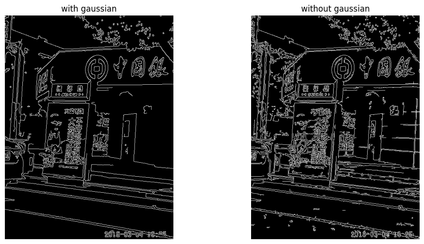
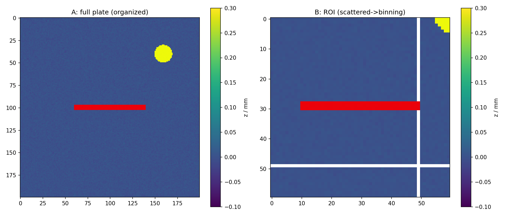
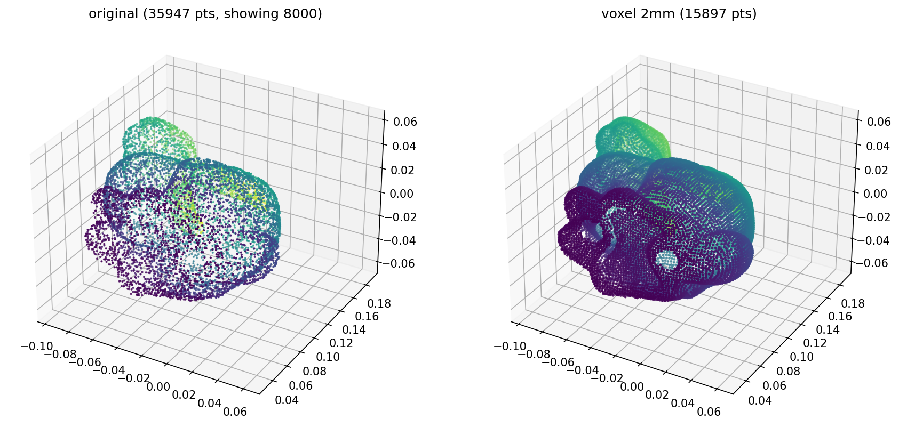

# 3d-vision-basics

Learning repo: industrial 3D vision inspection + edge AI + embodied perception.
Stage 1: 3D vision basics —— 从 2D 图像基础到 3D 点云质检最小闭环。


带练进度：Day 1 环境搭建 ✅ → Day 2 数字图像基础 ✅ → Day 3 点云质检流水线 ✅ → Day 4 真实数据集 ✅ → Day 5 点云配准 ICP（待开工）

## 成果预览

| Day 2 · Canny 边缘 | Day 3 · 缺陷检测 | Day 4 · 体素降采样 |
| :-: | :-: | :-: |
|  |  |  |
| 高斯平滑：外置 vs 内生对照 | 双阈值分割划痕/凸起（像素→mm²） | Stanford Bunny 35947 → 15897 点 |

## 目录结构

### `day02/` — 数字图像基础（OpenCV / NumPy / Matplotlib）

- `ex1_convolution.py` 手写卷积 + 诊断行；`ex1_vectorized.py` 向量化加速版（sliding_window_view + einsum，~147×）
- `ex2_edge.py` Canny 边缘提取 + 高低阈值对照实验
- `ex3_heightmap.py` 高度图可视化（伪彩色 / vmin-vmax 对照 / 3D 曲面）
- `ex4_fileio.py` 图像文件 IO（JPEG/PNG/npy 保真对比 + 标注画框）
- `ex5_homogeneous.py` 附加题：2D 齐次坐标刚体变换（直通 3D 4×4 外参）
- `ex*_*.png` 各练习交付图（入库）；`ex4_output/` 运行产物（可再生，已 gitignore）

### `day03/` — 点云质检全流程（Open3D + NumPy）

- `ex1_formats.py` 点云本质 + 4 种格式读写（npy/pcd/ply/xyz）；生成合成金属板 `plate.*`（seed 42，确定性可复现）
- `make_tiny_pcd.py` 生成 tiny.pcd，用于 pcd header 逐行解剖
- `ex2_pipeline.py` 预处理流水线：ROI 裁剪 → 体素降采样(0.1mm) → 统计滤波(k=20)，落盘 `clean_pts.npy`（40800→14475→3810→3735）
- `ex3_heightmap.py` 点云→高度图双路线：有组织 reshape vs 散点 mean binning（60×60，空格=NaN）
- `ex4_defect_detect.py` 双阈值缺陷检测（划痕 z<-0.05 / 凸起 z>0.08），像素→mm² 换算 + NG 判定
- `ex*_*.png` 交付图（入库）
- 数据产物（`plate.*` / `clean_pts.npy` / `heightmap.npy`，脚本可再生）已 gitignore

### `day04/` — 真实数据集：Stanford Bunny

- `ex1_bunny_to_pcd.py` 三角网格→点云：下载校验 → 顶点/面片体检 → 面积加权均匀采样 200 点 → 数学不变量断言 → npy+pcd 双落盘
- `make_bunny_full.py` 网格顶点全量落盘 `bunny_full.ply`（ex2 的输入，确定性可再生）
- `ex2_bunny_preprocess.py` 真实数据预处理：bbox 尺度体检 → voxel_size 三档扫描（1/2/5mm → 34583/15897/3023 点）→ 2mm 定稿 + 统计滤波（-394）→ npy 落盘
- `ex3_bunny_normals.py` 法线估计（knn=30 PCA）+ 一致性定向 + 法线着色可视化 + RANSAC 平面分割（真实曲面内点率 ~10% vs 合成平板）
- `ex4_bunny_defect.py` Day 4 收官闭环：真值法线注入压痕（抛物线 punch 轮廓）→ RaycastingScene 点到网格比对 → 检出率/精确率（47.31%/100%，阈值 1.5mm 卡噪声底与信号空档）
- 数据产物（`bunny_*.npy/pcd/ply`，脚本可再生）已 gitignore

## 复跑顺序（依赖链，缺产物就从第一步补）

### Day 4（首跑需联网下载 BunnyMesh，之后走 `~/open3d_data/` 缓存）

```bash
conda activate industrial3d
cd day04
python ex1_bunny_to_pcd.py      # BunnyMesh → bunny_pts.npy / bunny.pcd（200 点采样）
python make_bunny_full.py       # BunnyMesh 顶点全量 → bunny_full.ply（ex2 输入）
python ex2_bunny_preprocess.py  # bunny_full.ply → 体素降采样+统计滤波 → bunny_down/clean.npy
python ex3_bunny_normals.py     # bunny_clean.npy → ex3_normals_ransac.png（法线着色+RANSAC）
python ex4_bunny_defect.py      # bunny_clean.npy → ex4_defect_result.png（注入+CAD比对+两率）
```

### Day 3

```bash
conda activate industrial3d
cd day03
python ex1_formats.py        # 生成 plate.{npy,pcd,ply,xyz}
python ex2_pipeline.py       # plate.pcd → clean_pts.npy
python ex3_heightmap.py      # clean_pts.npy → heightmap.npy
python ex4_defect_detect.py  # plate.npy + heightmap.npy → ex4_defect.png
```

## 运行环境

WSL2 Ubuntu + conda 环境 `industrial3d`（Python 3.10 / PyTorch 2.1.2+cu121 / Open3D 0.18.0 / OpenCV 4.8.1 / NumPy 1.24.3 / Matplotlib 3.7.2）。

WSL 无显示器：所有图一律 `plt.savefig()`，用 `explorer.exe xxx.png` 查看。
